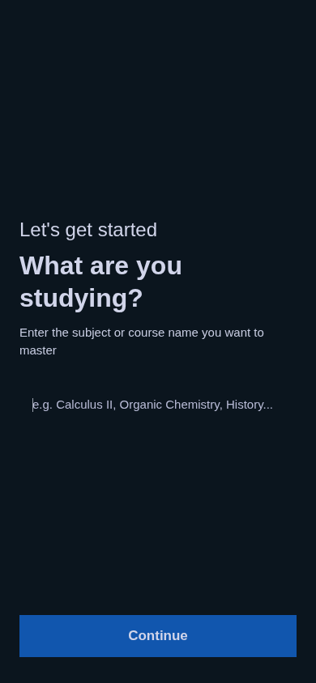
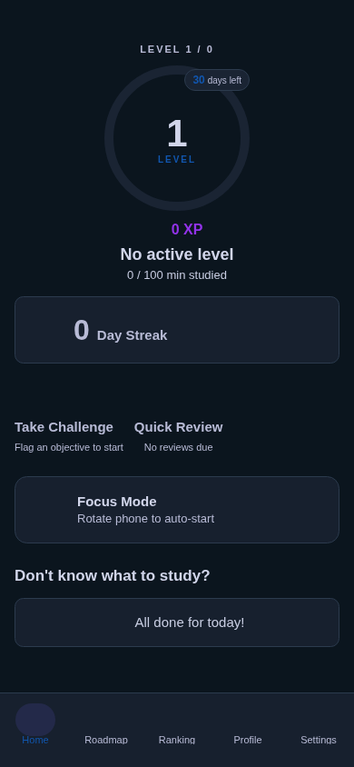
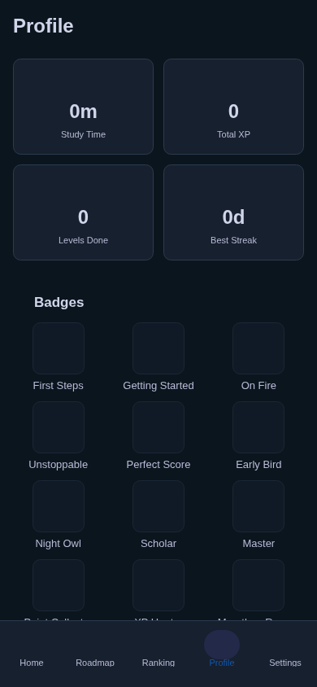

# StudyQuest

> AI-powered, gamified study planner — built in 24 hours at GDG AI Hack 2026, Milan.

---

## Screenshots

<p align="center">
  
  &nbsp;&nbsp;
  
  &nbsp;&nbsp;
  
</p>

---

## Hackathon Context

**Event:** [GDG AI HACK 2026](https://gdgaihack.com/) — organised by GDG on Campus PoliMi & GDG Cloud Milano  
**Date:** May 9–10, 2026 · Randstad Box, Milan  
**Scale:** 160 participants · 40 teams · €15,000+ in prizes  
**Track:** AI for Education, powered by [Braynr](https://braynr.app)

StudyQuest was our submission for the **education track**. The challenge: use AI to meaningfully improve how students learn, with Braynr's reading and retention data as the personalisation layer.

---

## The Problem

Students facing an exam in two weeks don't lack motivation — they lack a plan. Generic study apps give you a blank to-do list. AI tutors give you a chat window. Neither answers the real question: *"What exactly should I study today, and in what order?"*

StudyQuest answers that question by combining three things:

1. **AI source analysis** — Gemini reads your materials and maps the topic landscape
2. **Knowledge assessment** — a 12-question quiz before the roadmap is generated, so students who already know 70% of a subject skip the basics
3. **Adaptive scheduling** — if you fail a level quiz, the schedule adjusts forward; it doesn't reset

The result is a personalised, level-by-level roadmap where each level has a deadline, a quiz gate, and source-specific references.

---

## Key Features

| Feature | How it works |
|---|---|
| **AI Roadmap Generation** | Gemini 2.0 Flash analyses subject + sources and produces a structured level graph via native JSON schema output — no regex, no fragile parsing |
| **Knowledge Assessment** | 12-question quiz before onboarding completes; students with prior knowledge start at the right level |
| **Spaced Repetition** | Full SM-2+ engine with Leitner boxes (1/3/7/14/30-day intervals), ease-factor decay, and a reinforcement mode that forces struggling cards into every session until 2 consecutive correct answers |
| **Focus Mode** | Physically tilting the phone to landscape (detected via accelerometer) navigates to a distraction-free Pomodoro view — no chrome, no notifications |
| **Multi-roadmap** | Full multi-subject support with a roadmap switcher — each subject has independent levels, objectives, quizzes, and spaced rep cards |
| **Gamification** | Points, streaks, badges, streak multipliers (1.5×/2×/3× at 7/14/30 days), and a mock leaderboard showing your rank among friends |
| **Braynr Integration** | Syncs with a Braynr profile (reading speed, retention rate, avg session length) to personalise time estimates per level objective |
| **3-tier AI fallback** | Gemini SDK → OpenRouter → deterministic local mocks; the demo always works, even without API keys |

---

## Tech Stack

| Layer | Choice |
|---|---|
| Framework | Expo 54 / React Native 0.81 (iOS + Android + Web) |
| Language | TypeScript 5.9 |
| Routing | Expo Router — file-based, typed routes |
| State | Zustand 5 + AsyncStorage (persisted across sessions) |
| AI — primary | Google Gemini 2.0 Flash via `@google/generative-ai` SDK |
| AI — fallback | OpenRouter REST (`google/gemini-2.0-flash-001`) |
| Structured output | `responseSchema` + `responseMimeType: application/json` — zero fragile parsing |
| Animations | React Native Reanimated 4 (UI-thread, 60fps) |
| Styling | NativeWind 4 (Tailwind CSS for React Native) + design tokens |
| Motion | Expo Sensors / Accelerometer (tilt-to-focus) |

---

## Architecture

```
app/
  (onboarding)/          # 6-step modal flow
    subject.tsx          #   1. Subject title
    sources.tsx          #   2. PDFs / URLs / notes
    deadline.tsx         #   3. Deadline + hours/week
    processing.tsx       #   4. AI analysis (animated)
    assessment.tsx       #   5. Knowledge quiz (12 Qs)
    roadmap-reveal.tsx   #   6. Animated roadmap reveal
  (tabs)/
    index.tsx            # Home: today's objectives, streak, quick-review, roadmap switcher
    roadmap.tsx          # Full level map with status + deadlines
    leaderboard.tsx      # Leaderboard: podium view + ranked list
    profile.tsx          # Stats, badges
  quiz/[id].tsx          # Level quiz gate (pass = 70%+)
  quiz/daily-challenge.tsx
  focus.tsx              # Landscape focus mode + Pomodoro timer
  spaced-review.tsx      # Daily spaced repetition session

services/
  gemini.ts              # All Gemini prompt/schema definitions
  api.ts                 # 3-tier fallback orchestration
  spacedRepetition.ts    # SM-2+ Leitner box engine (5 boxes, ease factor, reinforcement mode)
  braynrParser.ts        # Parses Braynr export → reading speed / retention / session length
  roadmapEstimates.ts    # Per-objective time estimates using Braynr profile
  roadmapMerge.ts        # Roadmap adjustment after failed levels
  leaderboard.ts         # Leaderboard service (mock, ready for real API)
  mockData.ts            # Deterministic mocks keyed by subject title

hooks/
  useStudyStore.ts       # Central Zustand store (multi-roadmap, gamification, SR)
  useSpacedRepetition.ts
  useGamePoints.ts       # Points + streak multipliers + badge triggers
  useLeaderboard.ts      # Leaderboard data hook

components/
  RoadmapSelector.tsx    # Multi-roadmap switcher UI

constants/
  theme.ts               # Design tokens
  gamification.ts        # Point values, badge definitions, Pomodoro defaults

types/index.ts           # All shared TypeScript types (includes Roadmap type)
```

### AI fallback chain

```
api.generateRoadmap()
  │
  ├─ 1. Gemini SDK   responseSchema + responseMimeType: application/json
  │                  → type-safe structured output, no parsing
  │
  ├─ 2. OpenRouter   REST, OpenAI-compatible interface, same model
  │
  └─ 3. Mock data    deterministic generators keyed by subject title
                     → always works, even without API keys
```

---

## Getting Started

### Prerequisites

- Node.js 18+
- npm or yarn
- [Expo Go](https://expo.dev/go) on your phone (or a simulator)

### Install

```bash
git clone https://github.com/viganogabriele/gdg2026.git
cd gdg2026
npm install
```

### Environment variables

```bash
cp .env.example .env.local
```

| Variable | Where to get it | Required |
|---|---|---|
| `EXPO_PUBLIC_GEMINI_API_KEY` | Google Cloud Console → Generative Language API | Primary |
| `EXPO_PUBLIC_OPEN_ROUTER_API_KEY` | openrouter.ai/keys | Fallback |

> If both keys are absent the app falls back to local mock data — you can explore the full UI without any API keys.

### Run

```bash
npx expo start           # scan QR with Expo Go
npx expo start --web     # browser
npx expo start --ios     # iOS simulator
npx expo start --android
```

---

## Design Decisions Worth Noting

**Assessment-first, not onboarding-first.** Most apps dump you into a blank state and expect you to self-assess. We run a quiz *before* the roadmap is generated — a student who already knows half the material gets a shorter, more relevant roadmap immediately.

**Tilt-to-focus as a physical affordance.** The accelerometer runs in the root layout at 500ms intervals. When `|x| > 0.75 && |y| < 0.5`, the app navigates to focus mode and passes the tilt direction so the Pomodoro screen rotates accordingly. Rotating the phone isn't a gesture you do by accident — the transition to a distraction-free session requires a deliberate physical act.

**Structured AI output from day one.** Every Gemini call uses `responseSchema`. This meant zero time debugging malformed AI responses during the hackathon.

**SM-2+ with a reinforcement mode.** Standard SM-2 lets struggling cards drift. Our implementation tracks consecutive failures: after 3 misses, a card enters reinforcement mode and appears in every session until 2 consecutive correct answers. This is a real behaviour change, not just a cosmetic tweak to intervals.

---

## What We'd Do With More Time

- **Real source ingestion** — the picker accepts PDFs/URLs but Gemini currently only receives the subject title; fix is piping files through `inlineData`
- **Streaming roadmap generation** — `streamGenerateContent` so the roadmap appears node-by-node instead of a 10-second wait
- **Smarter rescheduling** — currently ±2 days of local logic after a failed level; better to send full context to Gemini and let it reason
- **Real leaderboard backend** — `services/leaderboard.ts` returns hardcoded mock data; the hook and UI are ready for a real API
- **Push notifications** — `services/notifications.ts` and `hooks/useNotifications.ts` are fully implemented but `initNotifications` is never called from the UI
- **Real Braynr import** — currently reads a hardcoded `assets/braynr-export.json`; the parser is ready, the file picker just needs wiring

---

## Built With

[Expo](https://expo.dev) · [Google Gemini](https://ai.google.dev) · [Braynr](https://braynr.app)  
Presented at [GDG AI HACK 2026](https://gdgaihack.com/), Milan
